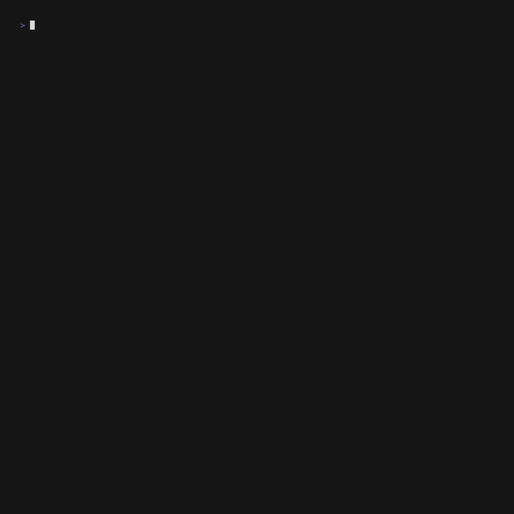

# Contributions

## Table of Contents

- [Conventions used for the examples in this repo ](#conventions-used-for-the-examples-in-this-repo)

- [Adding a new example to this repo](#adding-a-new-example-to-this-repo)
  - [Using `npn run create-example` to use another example as template](#using-npn-run-create-example-to-use-another-example-as-template)
  - [Cloning an example from another repo](#cloning-an-example-from-another-repo)

## Conventions used for the examples in this repo

> Check this [diagram](https://excalidraw.com/#json=apQs7adCZz7h45IayXAA5,k_i_h_XO_sixg7m1ev-2EA) for a visual guide of the conventions used in this repo for the examples

> [!IMPORTANT]
> The example `slug` should follow the convention `<plugin-slug>-<unique-code>`

- [ ] Each plugin has its own `<unique-code>`
  - Get it by running `npm run get:hexcode` from the root of the project
- [ ] Plugin **folder name** should be the `<slug>`
  - Ex: `block-dynamic-rendering-64756b`
- On **`<plugin-folder>/package.json`**
  - [ ] **`name`** should follow the convention `@gutenberg-examples/<slug>`
    - Ex: `"name": "@gutenberg-examples/block-static-rendering-b16608"`
  - [ ] **`files`** property should be set to `*`
    - Ex: `"files": [ "*" ]`
  - [ ] **`scripts`**
    - It should have, at least, the following [scripts](https://developer.wordpress.org/block-editor/reference-guides/packages/packages-scripts/) defined:

```
        "scripts": {
            "build": "wp-scripts build",
            "plugin-zip": "wp-scripts plugin-zip",
            "start": "wp-scripts start"
        }
```

- On **`<plugin-folder>/index.php`** the `Plugin Name` should follow the convention: `Gutenberg Examples` - `<example-name-including-unique-code>`
  - Ex `Plugin Name:  Gutenberg Examples - Non Block React WP Data 56d6f3`
- On **`<plugin-folder>/src/block.json`**
  - [ ] **`name`** should follow the convention `gutenberg-examples/<slug>`
    - Ex: `"name": "gutenberg-examples/block-static-rendering-b16608"`
  - [ ] **`keywords`** should include, at least, the `<unique-code>`
    - Ex: `"keywords": [ "64756b"]`
- [ ] Block CSS class should follow the convention `.wp-block-gutenberg-examples-<slug>`
  - Ex: `.wp-block-gutenberg-examples-editable-block-1b8c51`
- On **`<root-folder>/.wp-env.json`**
  - [ ] The local path of the plugin/example (starting from root) should be included in the array `"plugins"`
    - Ex: `"./plugins/basic-block-3df23d"`
- On **`data/example.json`**
  - [ ] Should have an object (in the array) representing your example with the following info: `slug`, `description` & `tags`. The `tags` property should contain an array of tags "slugs" existing in `data/tags.json`
    - Ex:

```
{
    "slug": "minimal-block-no-build-e621a6",
    "description": "Minimal Gutenberg Block (No Build)",
    "tags": [
      "minimal",
      "no-build"
    ]
  }
```

- On **`<root-folder>/README.md`**
  - [ ] Add a new row with the plugin/example info. You can do so by running `npm run table:update`
    - Ex: `npm run table:update`

After ensuring these changes a new install of dependencies and build should be run from the root of the project

```
pnpm i
npm run build
```

## Adding a new example to this repo

### Using `npm run create-example` to use another example as template

This repo offers you a script to create a new example using any of already existing examples as a template.

1. Run `npm run create-example`
1. Choose the example you want to use as a template for your new example
1. Add a meaningful name for your example
1. Add a description for your example
1. Add tags for your example

The script will take care of most of the modifications needed so your new example follow the conventions of this repo.



### Cloning an example from another repo

If you have another repo containing a plugin with an example you'd like to add as new example of this repo:

1. Go to the `plugins` folder and clone your repo with your example there
1. Go inside your project's folder
1. Delete the `.git` folder
1. Do the proper changes to adapt your plugin to follow the conventions for this repo
