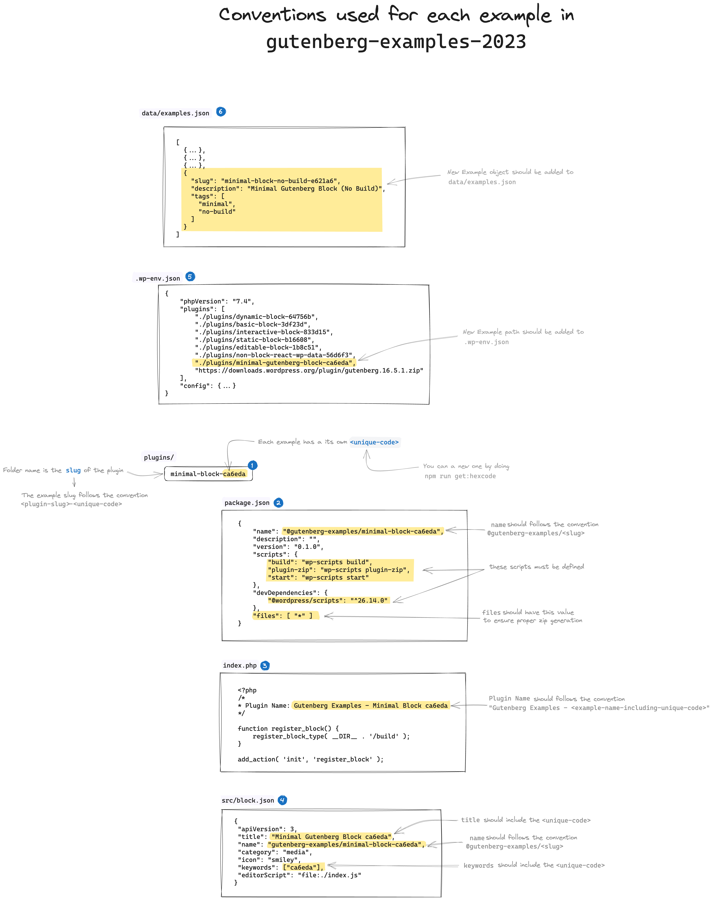

# Contributions

## Conventions used for each example in this repo 

> See [diagram](https://excalidraw.com/#json=LgGQyBclSqpidwEseYgyK,O-mTI_VaTfSd-OlEPkj9_w) 

> [!IMPORTANT]
> The example `slug` should follow the convention `<plugin-slug>-<unique-code>`

- [ ] Each plugin has its own `<unique-code>` 
    - Get it by running `npm run get:hexcode` from the root of the project
- [ ] Plugin **folder name** should be the `<slug>`
    - Ex: `dynamic-block-64756b`
- On **`<plugin-folder>/package.json`**
    - [ ] **`name`** should follow the convention `@gutenberg-examples/<slug>` 
        - Ex: `"name": "@gutenberg-examples/static-block-b16608"`
    - [ ] **`files`** property should be set to `*`
        - Ex: `"files": [ "*" ]`
    - [ ] **`scripts`** 
        - It should have, at least, the following [scripts](https://developer.wordpress.org/block-editor/reference-guides/packages/packages-scripts/) defined:
```
        "scripts": {
            "build": "wp-scripts build",
            "plugin-zip": "wp-scripts plugin-zip",
            "start": "wp-scripts start"
        }
```
    
- On **`<plugin-folder>/index.php`** the `Plugin Name` should follow the convention: `Gutenberg Examples` - `<example-name-including-unique-code>`
     - Ex `Plugin Name:  Gutenberg Examples - Non Block React WP Data 56d6f3`
- On **`<plugin-folder>/src/block.json`**
    - [ ] **`title`** should include the `<unique-code>` 
        - Ex: `"title": "Minimal Gutenberg Block ca6eda",`
    - [ ] **`name`** should follow the convention `gutenberg-examples/<slug>` 
        - Ex: `"name": "gutenberg-examples/static-block-b16608"`
    - [ ] **`keywords`** should include, at least, the `<unique-code>`
        - Ex: `"keywords": [ "64756b"]`    
- [ ] Block CSS class should follow the convention `.wp-block-gutenberg-examples-<slug>`
    - Ex: `.wp-block-gutenberg-examples-editable-block-1b8c51`    
- On **`<root-folder>/.wp-env.json`**
    - [ ] The local path of the plugin/example (starting from root) should be included in the array `"plugins"` 
        - Ex: `"./plugins/basic-block-3df23d"`
- On **`data/example.json`**
    - [ ] Add a new object to the array representing your example with the following info: `slug`, `description` & `tags`. The `tags` property should contain an array of tags "slugs" existing in  `data/tags.json`
        - Ex:

```
{
    "slug": "minimal-block-no-build-e621a6",
    "description": "Minimal Gutenberg Block (No Build)",
    "tags": [
      "minimal",
      "no-build"
    ]
  }
```
- On **`<root-folder>/README.md`**
    - [ ] Add a new row with the plugin/example info. You can do so by running `npm run table:update`
        - Ex: `npm run table:update`

After ensuring these changes a new install of dependencies and build should be run from the root of the project

```
pnpm i
npm run build
```

