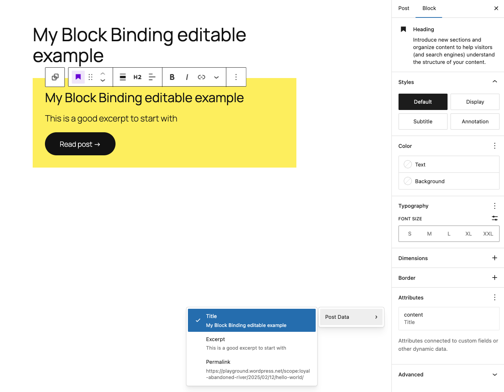

# Editor Bindings

This example is taken from the following WordPress Developer Blog post:

-   [Getting and setting Block Binding values in the Editor](https://developer.wordpress.org/news/2024/10/getting-and-setting-block-binding-values-in-the-editor/)

<!-- Please, do not remove these @TABLE EXAMPLES BEGIN and @TABLE EXAMPLES END comments or modify the table inside. This table is automatically generated from the data at _data/examples.json and _data/tags.json -->
<!-- @TABLE EXAMPLES BEGIN -->

| Example                                                                                                       | Description                                 | Tags                                                                                                                                 | Download .zip                                                                                                                                                                                                     | Live Demo                                                                                                                                                                                                                                                                                                                                   |
| ------------------------------------------------------------------------------------------------------------- | --------------------------------------------------------------------------------------------------- | ------------------------------------------------------------------------------------------------------------------------------------ | ----------------------------------------------------------------------------------------------------------------------------------------------------------------------------------------------------------------- | ------------------------------------------------------------------------------------------------------------------------------------------------------------------------------------------------------------------------------------------------------------------------------------------------------------------------------------------- |
| [Editor Bindings](https://github.com/WordPress/block-development-examples/tree/trunk/plugins/editor-bindings) | Shows how to create a block that uses editor bindings to connect custom fields to the block editor. | <small><code><a href="https://WordPress.github.io/block-development-examples/?tags=block-bindings">block-bindings</a></code></small> | [📦](https://github.com/WordPress/block-development-examples/releases/download/latest/editor-bindings.zip 'Install the plugin on any WordPress site using this zip and activate it to see the example in action') |  |

<!-- @TABLE EXAMPLES END -->

## Understanding the Example Code

Some key ideas for this example:

-   **Custom Binding Source Registration**: The plugin registers a `block-dev-ex/post-data` binding source both server-side (`register_block_bindings_source()`) and client-side (`registerBlockBindingsSource()`)
-   **Dynamic Data Access**: The binding source provides access to post title, excerpt, and permalink through the Block Bindings API
-   **Editor Integration**: Uses WordPress Data API (`@wordpress/blocks` and editor store) to fetch and update post data in real-time
-   **Controlled Editability**: Implements `canUserEditValue()` to make title and excerpt editable while keeping permalink read-only
-   **Context-Aware**: Uses `postId` context to determine which post's data to fetch and display

## Related resources

-   [Block Bindings API documentation](https://developer.wordpress.org/block-editor/reference-guides/block-api/block-bindings/)
-   [`registerBlockBindingsSource` documentation](https://developer.wordpress.org/block-editor/reference-guides/packages/packages-blocks/#registerbindingsource)

---

> **Note**
> Check the [Start Guide for local development with the examples](https://github.com/WordPress/block-development-examples/wiki/Examples#start-guide-for-local-development-with-the-examples)
