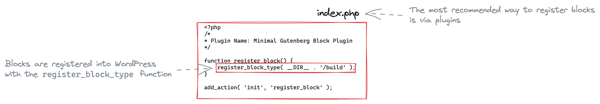
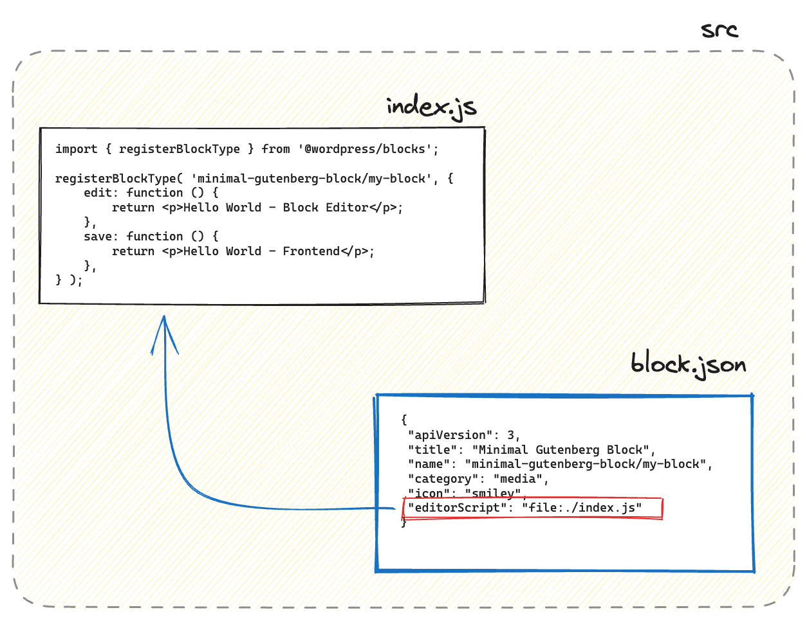

# Minimal Gutenberg Block

This example contains a plugin that register a minimal block that has been defined using JSX so it needs a `build` process to convert the JSX syntax into JS code that browsers can understand (ES5).

> [See diagram](https://excalidraw.com/#json=p5GXuqsMjZe7pEJ99-6EM,OuVzzTujO91JYnCSNVwEBg) 

<!-- Please, do not remove these @TABLE EXAMPLES BEGIN and @TABLE EXAMPLES END comments or modify the table inside. This table is automatically generated from the data at _data/examples.json and _data/tags.json -->
<!-- @TABLE EXAMPLES BEGIN -->
| Folder                                                                                                | <span style="display: inline-block; width:250px">Short description</span> | Tags                                                                                                                                                                                                                                                             | ID ([❓](https://github.com/WordPress/block-development-examples/wiki/04-Why-an-ID-for-every-example%3F "Why an ID for every example?")) | Download .zip                                                                                                                                                                                                                                                    | Live Demo                                                                                                                                                                                                                                                                                                                                                                            |
| ----------------------------------------------------------------------------------------------------- | ------------------------------------------------------------------------- | ---------------------------------------------------------------------------------------------------------------------------------------------------------------------------------------------------------------------------------------------------------------- | --------------------------------------------------------------------------------------------------------------------------------------- | ---------------------------------------------------------------------------------------------------------------------------------------------------------------------------------------------------------------------------------------------------------------- | ------------------------------------------------------------------------------------------------------------------------------------------------------------------------------------------------------------------------------------------------------------------------------------------------------------------------------------------------------------------------------------ |
| [📁](https://github.com/WordPress/block-development-examples/tree/trunk/plugins/minimal-block-ca6eda) | Minimal Block                                                             | <small><code><a href="https://github.com/WordPress/block-development-examples/wiki/03-Tags#minimal">MINIMAL</a></code></small>, <small><code><a href="https://github.com/WordPress/block-development-examples/wiki/03-Tags#featured">FEATURED</a></code></small> | `ca6eda`                                                                                                                                | [📦](https://raw.githubusercontent.com/WordPress/block-development-examples/deploy/zips/minimal-block-ca6eda.zip "Install the plugin using this zip and activate it. Then use the ID of the block (ca6eda) to find it and add it to a post to see it in action") | [](https://playground.wordpress.net/?blueprint-url=https://raw.githubusercontent.com/WordPress/block-development-examples/trunk/plugins/minimal-block-ca6eda/_playground/blueprint.json "Use the ID of the block (ca6eda) to find it and add it to a post to see it in action") |
<!-- @TABLE EXAMPLES END -->

## Understanding the Example Code

### Table of Contents

- [Anatomy of this block](#anatomy-of-this-block)
  - [The plugin](#the-plugin)   
  - [The block](#the-block) 

### Anatomy of this block

The essential files for this block are:

- `index.php`
    - Main file for the plugin that will register our block
- `src/block.json`
    - Main file for the block definition (metadata)
- `src/index.js`
    - Starting point for block behaviour definitions


The `package.json` fle include dependencies needed for "build" time. In this minimal version it just includes the [`@wordpress/scripts`](https://developer.wordpress.org/block-editor/reference-guides/packages/packages-scripts/) dependency and the `build` script that will allow us to easily run a build process for our block.

```json
{
    "name": "minimal-gutenberg-block",
    "description": "",
    "version": "0.1.0",
    "scripts": {
        "build": "wp-scripts build"
    },
    "devDependencies": {
        "@wordpress/scripts": "^26.14.0"
    }
}

```

#### The plugin 



The most recommended way to register a block is via a plugin. Every plugin starts with a `.php` file defining some hooks that will be executed at different moments of the WordPress loading sequence.

```php
<?php
/*
* Plugin Name: Minimal Gutenberg Block Plugin
*/

function register_block() {
    register_block_type( __DIR__ . '/build' );
}

add_action( 'init', 'register_block' );
```

This plugin use the [`register_block_type`](https://developer.wordpress.org/reference/functions/register_block_type/) function to register a block when the WordPress loading sequence starts ([`init`](https://developer.wordpress.org/reference/hooks/init/) hook)

[`register_block_type`](https://developer.wordpress.org/reference/functions/register_block_type/) needs to point to a `block.json` path. In this examples it points to the one stored in the generated `build` folder (and not the one in the `src` folder) because that's the one that will point to the JS code ready for production.

#### The block 



Any block's definition starts with a [`block.json` which contains the metadata for the block](https://developer.wordpress.org/block-editor/reference-guides/block-api/block-metadata/). This file contains, among other things, the paths of the js files that will conform the behaviour and appearance of our block.

```json
{
	"apiVersion": 3,
	"title": "Minimal Gutenberg Block",
	"name": "minimal-gutenberg-block/my-block",
	"category": "media",
	"icon": "smiley",
	"editorScript": "file:./index.js"
}
```

In our minimal example, it just contains the path for the javascript file ([`editorScript` property](https://developer.wordpress.org/block-editor/reference-guides/block-api/block-metadata/#editor-script)) that defines the interface for how our block is going to be rendered within the editor, how it will operate and be manipulated, and how it will be saved.

```js
import { registerBlockType } from '@wordpress/blocks';

registerBlockType( 'minimal-gutenberg-block/my-block', {
    edit: function () {
        return <p>Hello World - Block Editor</p>;
    },
    save: function () {
        return <p>Hello World - Frontend</p>;
    },
} );
```

The [`registerBlockType`](https://developer.wordpress.org/block-editor/reference-guides/block-api/block-registration/#registerblocktype) function registers our block in the Block Editor (so it can be found and inserted). This function takes two arguments
- Our [block name](https://developer.wordpress.org/block-editor/reference-guides/block-api/block-registration/#block-name) → `minimal-gutenberg-block/my-block`
- A configuration object, with the [edit and save functions](https://developer.wordpress.org/block-editor/reference-guides/block-api/block-edit-save/)
    - `edit` → React component that will be loaded in the Block Editor for our block
    - `save` → What will be stored in the DB for our block

## Related resources

Bulleted list of references

----

> **Note**
> Check the [Start Guide for local development with the examples](https://github.com/WordPress/block-development-examples/wiki/02-Examples#start-guide-for-local-development-with-the-examples)
